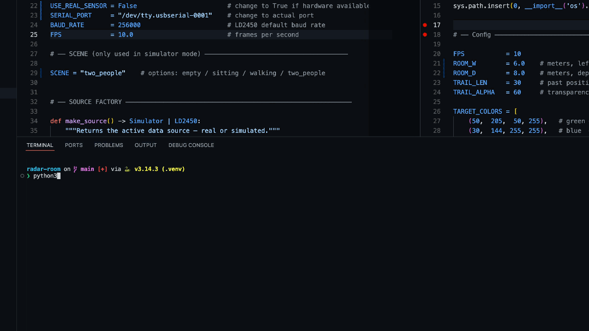
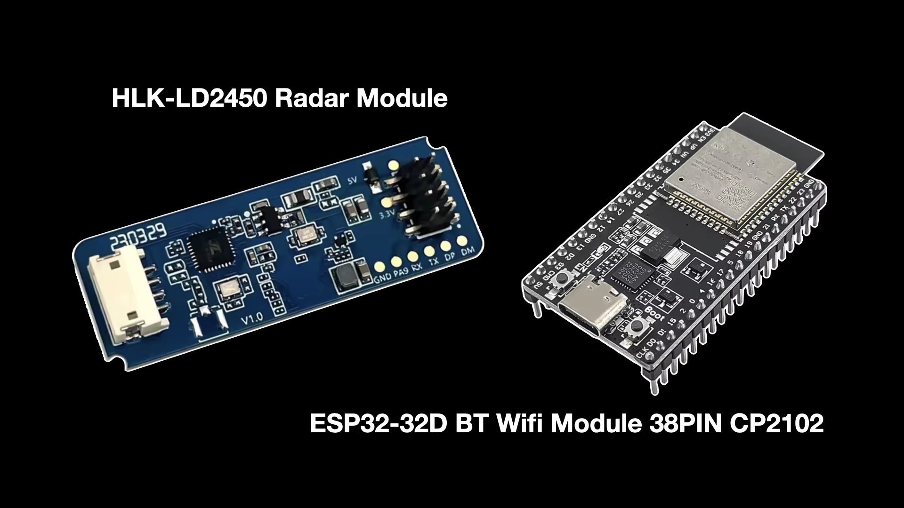

# radar-room

<div align="left">
	
</div>


A room that sees without cameras. Real-time human presence and motion visualization using a 24GHz FMCW radar sensor, running fully local for under €20 of hardware.

> **Note:** Waiting for hardware — tested only simulation as of 30 March 2026.


---

## What it does

A single HLK-LD2450 radar module streams target position and velocity data over UART to a Mac. A Python pipeline parses the binary frames and renders them live in a bird's-eye dashboard. An ML activity classifier is planned.

No camera. No cloud. Everything runs locally.


## Simulation Demo

<div align="left">
	
</div>


---

## How it works

The HLK-LD2450 is a 24GHz FMCW (Frequency Modulated Continuous Wave) radar. It continuously broadcasts radio chirps that bounce off people in the room. By analyzing reflected signals, it extracts X/Y position and radial velocity of up to 3 targets simultaneously, streaming binary frames over UART at 10Hz.

In simplified terms: beat frequency relates to range, while Doppler shift relates to radial velocity. There is no image stream, which is generally more privacy-preserving than cameras, but motion and occupancy data are still sensitive.

The Python pipeline:
1. Reads and parses binary frames from the sensor via USB serial
2. Converts raw millimetre values to metres
3. Renders a live bird's-eye visualization with target trails
4. (Planned) Classifies room activity using a trained scikit-learn model

---

## Hardware

| Component | Details | Price |
|---|---|---|
| HLK-LD2450 | 24GHz FMCW radar, ±60° FOV, 8m range | ~€11 |
| ESP32 WROOM-32D | CP2102 USB-UART bridge, USB-C | ~€5 |
| Jumper wires | Female-female, 20cm | ~€2 |
| **Total** | | **~€18** |

<div align="left">
	
</div>

### Wiring

```
LD2450        ESP32
──────────────────────
VCC (red)  →  VIN
GND (blk)  →  GND
TX  (grn)  →  GPIO16
RX  (yel)  →  GPIO17
```

ESP32 connects to Mac via USB-C. No soldering required.

---

## Project structure

```
radar-room/
├── sensor/
│   ├── simulator.py   # realistic fake data for development without hardware
│   └── ld2450.py      # real UART parser for HLK-LD2450
├── viz/
│   └── dashboard.py   # live bird's-eye PyQtGraph visualization
├── ml/
│   ├── collect.py     # record labelled sessions for training
│   ├── train.py       # train scikit-learn activity classifier
│   └── inference.py   # run live ML predictions on radar stream
├── main.py            # entry point — one switch for real vs simulated data
├── requirements.txt
└── README.md
```

---

## Quickstart

### 1. Clone and set up

```bash
git clone https://github.com/cspz/radar-room.git
cd radar-room
python3 -m venv .venv
source .venv/bin/activate
pip install -r requirements.txt
```

### 2. Run with simulated data (no hardware needed)

```bash
python3 main.py
```

A live dashboard opens immediately. Change the scene at the top of `main.py`:

```python
SCENE = "walking"    # empty / sitting / walking / two_people
```

### 3. Run with real hardware

Connect the LD2450 via ESP32 and USB-C. Find your serial port:

```bash
ls /dev/tty.usb*
```

Then in `main.py` set:

```python
USE_REAL_SENSOR = True
SERIAL_PORT     = "/dev/tty.usbserial-XXXX"
```

Run:

```bash
python3 main.py
```

---

## Dashboard

- White triangle — sensor position at origin
- Blue cone — 60° field of view
- Range rings — at 2m, 4m, 6m, 8m
- Coloured dots — live target positions (green / blue / red for targets 1–2–3)
- Trails — last 30 positions per target
- Status bar — real-time coordinates and speed per target

---

## ML activity classifier

Planned — not yet implemented.

Target classes: `empty` · `sitting` · `walking` · `two_people`

Planned workflow:
1. Record labelled sessions (`ml/collect.py`)
2. Train a classifier (`ml/train.py`)
3. Run live inference overlay (`ml/inference.py` + dashboard integration)

---

## Roadmap

- ✅ Simulator with realistic physics-based scenes
- ✅ Binary UART parser for HLK-LD2450
- ✅ Real-time bird's-eye dashboard
- ⬜ ML activity classifier
- ⬜ Live inference overlay on dashboard
- ⬜ Multi-sensor triangulation (3× LD2450)
- ⬜ 3D visualization
- ⬜ Sensor fusion — mmWave + WiFi for room-scale spatial mapping and precise localization

---

## Dependencies

```
pyserial
numpy
pyqtgraph
PyQt6
```

Planned ML dependency (when classifier work starts):

```
scikit-learn
```

```bash
pip install -r requirements.txt
```

---

## License

MIT
